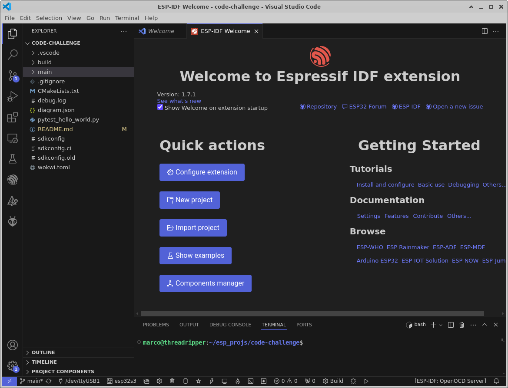

## Coding Challenge


[Running code challenge implementation on WOKWI](https://wokwi.com/projects/400828186491083777)


Prepare following tools:
### Visual Studio Code with ESP-IDF 5 plugin




Provide following code functionality:
### Create two RTOS tasks running on different cores

```c

    // Create task1 on Core 0
    if ( xTaskCreatePinnedToCore(task1, "Task1", 2048, NULL, 2, NULL, 0) != pdPASS ) ...
    // Create task2 on Core 1
    if ( xTaskCreatePinnedToCore(task2, "Task2", 2048, NULL, 1, NULL, 1) != pdPASS ) ...

```

    


### Task1 should run every 10 ms using the RTOS delay functions

```c
// Task to be run on Core 0
void task1(void *pvParameters) 
{
...
    while (1) 
    {  
        vTaskDelay(TASK1_SCHEDULING_TIME);    
    ...
    }
} 

```


### Task1 has a buffer of size 100 holding the time interval for each execution measured by the integrated ESP timing functions

https://de.wikipedia.org/wiki/Doppelpufferung

Doppelpufferung (englisch double buffering) ist ein Verfahren der Computergrafik, bei dem ein Datenpuffer, der gleichzeitig beschrieben und gelesen wird, doppelt ausgeführt ist, um gegenseitige Störungen zu vermeiden.

In anderen Bereichen (vor allem in Echtzeit-Anwendungen) wird die Doppelpufferung als Wechselpuffertechnik bezeichnet. Ein Wechselpuffer entspricht einem Ringpuffer mit zwei Plätzen (Erzeuger-Verbraucher-Problem).

```c
#define DT_BUFF_SZ      100
#define DT_BUFF_COUNT   2
BUFFER_TYPEDEF(dt_buff_t,int64_t,DT_BUFF_SZ);


ITEMPOOL_TYPEDEF(dt_pool_t,BUFFER_T(dt_buff_t),DT_BUFF_COUNT);
ITEMPOOL_T(dt_pool_t) dt_pool;  // shared resource
```


### After 1 s the Task1 should send the second task a signal getting the content of the buffer


BUFFER FILL TIME = DT_BUFF_SZ x TASK1_SCHEDULING_TIME = 100*10ms = 1s 

Mögliche IPC Mechanismen:

Task Notifications: einfache, effiziente Benachrichtigungen.
Message Queues: Übertragung komplexer Datenstrukturen.
Event Groups: Synchronisation von Ereignissen.
Semaphores: Signalisierung und den gegenseitigen Ausschluss.
Stream Buffers: kontinuierliche Datenströme.
Message Buffers: diskrete Nachrichten.

Da Messages Queues im Gegensatz zu Notifications gepuffert sind, kann Task1 ohne durch Task2 blockiert zu werden weiterarbeiten. Bei Notifications muß Task1 solange warten, bis Task2 die Nachricht entgegengenommen hat.

Da bei der Doppelbufferung auf eine gemeinsame Resource zugegriffen wird, wird ein Mutex benötigt um den gegenseitigen Zugriff auf die Resource zu regeln.


```c 
...

BUFFER_APPEND(*dt_curr,dt_stop - dt_start);
...
        if( BUFFER_FULL(*dt_curr) )
        {
            xQueueSend(dt_msg_queue, (void *)&dt_curr , portMAX_DELAY);
            dt_curr = NULL;
            ...

            dt_curr = ITEMPOOL_ALLOC(dt_pool);
            ...            
```


### Task2 waits for the signal of the first task

```c 
    while (1) 
    {

        // wait for IPC message from Task1
        xQueueReceive(dt_msg_queue, (void *)&dt_curr, portMAX_DELAY);
        ...
```        


### If signalized, Task1 computes minimum, maximum and mean of the values from the buffer of the first task
```c 


        int64_t mean = 0;
        int64_t min = INT64_MAX;
        int64_t max = INT64_MIN;

        int64_t *curr;
        
        BUFFER_FOREACH(*dt_curr,curr)
        {
            if ( *curr > max )
            {
                max = *curr;
            }

            if ( *curr < min )
            {
                min = *curr;
            }

            mean+=*curr;
        }
        
        mean/=BUFFER_COUNT(*dt_curr);
```   

### After computation, print out the values for debugging purposes

```c 
DBG("Task2 : min=%lld; max=%lld; mean=%lld\n", min, max, mean); 
```  


### Please make sure: Tasks are not blocking CPU time

By using FreeRTOS primitives for synchronisation, IPC and delays, there is no blocking of CPU time.


### Please make sure: Use as little as possible global variables

Global variables required : shared between Task1 and Task2 : 1 Mutex, 1 Message Queue, 1 Buffer Memory Pool


### All other decisions are made by you how you would implement the functionality.
